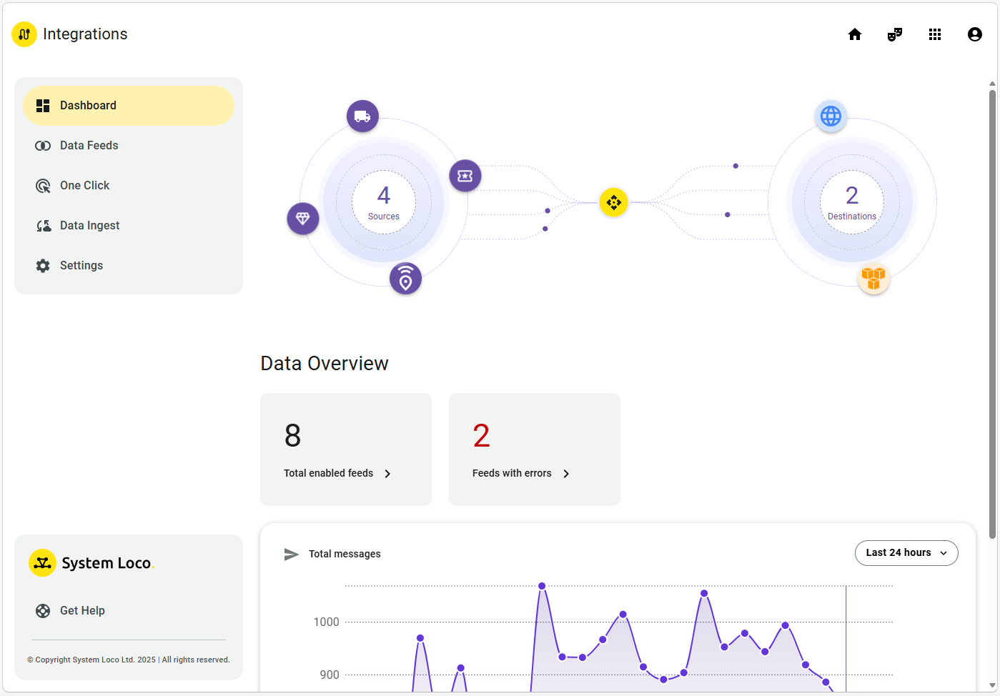
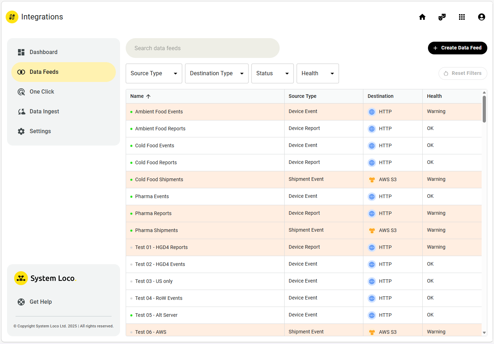
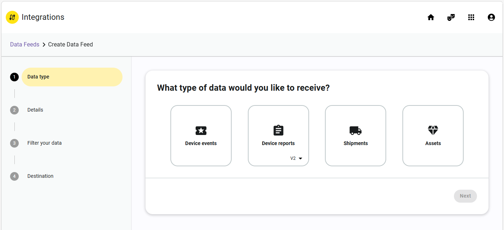
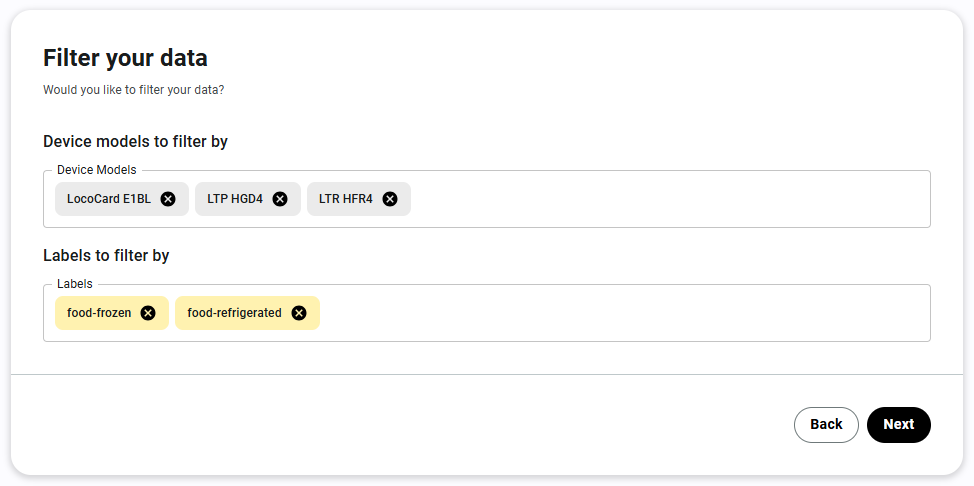
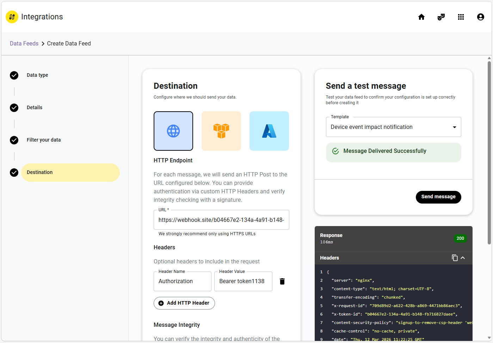
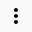
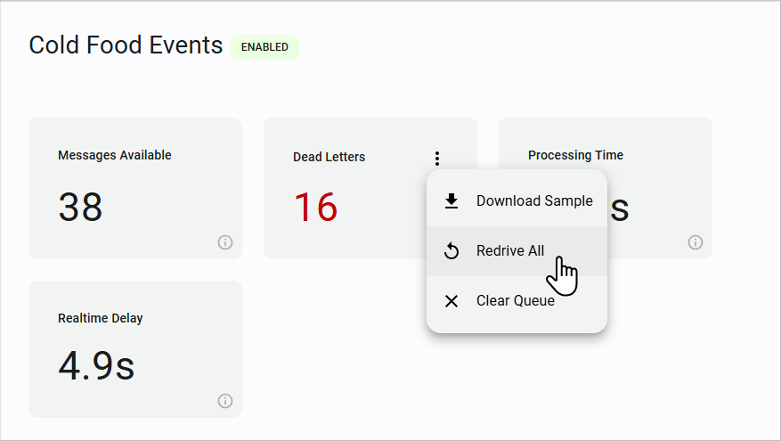
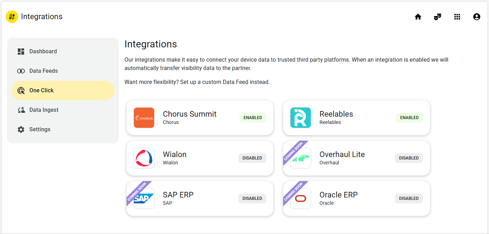
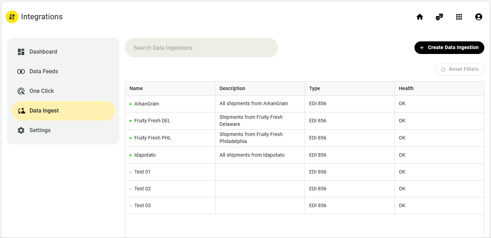
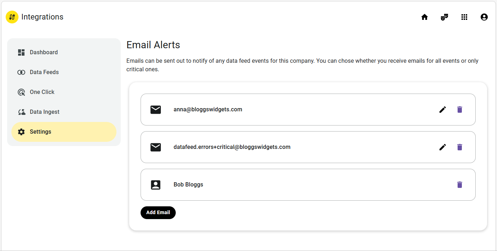

# The LocoAware Integrations App

The Integrations app is where you manage the integrations between LocoAware and your own systems. This guide covers what the app does, how each page works, and how it connects to the webhook receivers shipped in this repository.

There are three types of integration:

- **Data feeds** — configurable integrations that send specific data from LocoAware to a defined destination. Data can include device events, device reports, shipments, or assets; supported destinations include HTTP endpoints, AWS S3 buckets, and Azure Blob Storage.
- **One click integrations** — preconfigured integrations with supported logistics platforms (such as Wialon and Chorus Summit) and industry-standard ERP systems (such as SAP and Oracle).
- **Data ingestions** — integrations for accepting certain data from third party platforms into LocoAware, such as EDI 856 Advance Shipping Notices.

The type of integration you use depends on your requirements. One click integrations are easy to set up and maintain but may not give the flexibility that you need. Data feeds require more configuration but can send exactly the data you need to a customized endpoint — this repository exists to help you stand up a receiver for those feeds quickly.

> **Building a receiver?** See the [Device Reports V2](./Device_Reports_V2_Integration_Guide.md), [Device Events](./Device_Events_Integration_Guide.md), [Shipments](./Shipments_Integration_Guide.md), and [Assets](./Assets_Integration_Guide.md) integration guides for payload reference, and the [examples](./examples/) folder for runnable reference implementations.

---

## Pages in the Integrations app

The Integrations app includes the following pages:

- **Dashboard** — an overview of your data feeds, helping you check quickly and easily whether your integrations are working correctly. Includes shortcuts to view data feeds by source type or destination type.
- **Data Feeds** — the list of all data feeds set up for your company. Filter by source type, destination type, status, and health. This is also where you manage data feeds and their dead letter queues.
- **One Click** — shows the available preconfigured one click integrations and their current status.
- **Data Ingest** — lists all the data ingestions set up for your company. Data ingestions provide a mechanism for LocoAware to accept certain data (such as EDI 856 Advance Shipping Notices) from third party platforms. A data ingestion includes a destination (the webhook URL to which your platform can send data) and an expected format (which defines the type of data that LocoAware will receive through that endpoint).
- **Settings** — configure email alerts so key users can be notified of their company's data feed events.

### Legacy data feeds

The Integrations app does not show older webhook data feeds that you might have in place for your company or for specific devices. These are legacy functionality — while they will continue to work (and will remain visible in company and device properties), we recommend using the Integrations app for any new data feeds. See [Legacy data feeds](#legacy-data-feeds) below.

### LocoAware API

While the LocoAware API can be used to extract device data from LocoAware, it is intended as a tool for managing your LocoAware system — using a third party system to view and modify device status, for example. To get live data from LocoAware, we strongly recommend using data feeds or one click integrations instead. For more details on LocoAware API requests, see the LocoAware API Docs.

### User permissions

All LocoAware functionality depends on the permissions of your company, role, and user account. If you cannot see a function, setting, or data that is described in this guide, it is usually because you do not have the required permissions. If you need additional permissions, contact your account manager or System Loco Support.

---

## Integrations dashboard

The Integrations dashboard shows an overview of your data feeds.



The visualization at the top of the dashboard shows the number of different sources (source data types) and destination types currently active — that is, the number in use by active data feeds. There may be many data feeds using each type. The icons rotating around the circles represent each source type and destination type; click an icon to open the Data Feeds list filtered to show only that type.

Below the visualization is a **Data Overview** section showing how many of your data feeds are enabled and how many have errors. Click a tile to open the Data Feeds list, filtered accordingly.

At the bottom of the Data Overview section is a graph showing how many messages have been sent successfully over the last 24 hours, 3 days, or 7 days. Hover over a point to see exactly how many messages were sent during a specific time period.

---

## Data Feeds

A data feed is a configurable integration that sends specific data from LocoAware to a destination. This data can include device events, device reports, shipments, or assets; supported destinations include HTTP endpoints, AWS S3 buckets, and Azure Blob Storage.

The Data Feeds list shows all the data feeds set up for your company:



You can see the current status of each data feed at a glance:

- Enabled (active) data feeds have **green** dots to the left of their names; disabled (inactive) ones have **gray** dots.
- Healthy data feeds show **OK** in the Health column. Any that are not performing correctly (that is, any that have failed messages in their dead letter queues) are highlighted and labelled **Warning**.

Click a data feed to view its properties (see [Data feed properties](#data-feed-properties)). From the list you can also filter, search, and reorder; share the list as a simple report; create new data feeds; and disable, enable, or delete data feeds.

### Filtering the Data Feeds list

Filter by source type, destination type, status, and health, or use the search bar at the top of the page. As you type into the search bar, LocoAware searches data feed names for the text you have entered so far — click a single result to go directly to its properties, or press <kbd>Enter</kbd> to filter the list on the text you entered.

You can also reorder the list by clicking on column headers. Click a header again to reverse the order.

### Sharing the Data Feeds list

When you have the list filtered as required, you can copy its URL for use as a simple report. For example, this URL shows all Device Event data feeds available to you that are currently enabled:

```
https://www.locoaware.com/v2/integrations/datafeeds?type=event&status=enabled
```

> **Note:** The Data Feeds list is always constrained by your user permissions. If you share a URL with someone from a different company, they will see different data feeds.

### Creating data feeds

To create a new data feed:

1. Open the Data Feeds list and click **Create Data Feed** (top right of the list). LocoAware opens a wizard.
2. On the **Data type** screen, select the type of data feed that you want to receive from LocoAware, then click **Next**.

   

   You can select **Device events**, **Device reports**, **Shipments**, or **Assets**.

   > **Note:** For device reports, you can also choose whether you want the current type of data feed or the older, classic type. Unless you already have data feeds set up using the older type, leave the dropdown set to **V2**. See [Legacy data feeds](#legacy-data-feeds).

3. On the **Details** screen, enter a **Name** and **Description**, then click **Next**.
4. If you selected **Device events** or **Device reports**, the **Filter your data** screen lets you specify one or more **Device Models** and/or **Labels**. Your data feed will include data from any of the specified device models that has at least one of the specified labels.

   For example, a data feed with the following filters will include data from all LocoCard E1BLs, LocoTrack HGD4s, and LocoTrack HFR4s labelled either `food-frozen` or `food-refrigerated`:

   

   If you do not specify any filters, the data feed will include data from all your company's devices.

5. On the **Destination** screen, select the icon for the destination type — **HTTP Endpoint**, **AWS S3 Bucket**, or **Azure Blob Storage**.
6. Enter the settings required to send data to your destination. Each destination type requires its own settings — an HTTP endpoint requires a URL and any HTTP headers needed for authentication, whereas an Azure Blob Storage endpoint requires an account name, container name, and access key. Contact your system administrator if you do not know what settings your destination requires.
7. Before creating your data feed, test it. In the **Send a test message** section (on the right side of the screen), select a **Template**. The list includes typical messages for the specified type of data feed — for example, when creating a Device Event data feed, test messages can simulate a device entering a zone, getting dropped, reaching a critical battery level, and so on.
8. Click **Send message** to send the test message. LocoAware creates a test message, attempts to send it to your destination, and shows any response along with the message request itself:

   

9. Check that the test message has been received and processed correctly by your destination system, then click **Create**. LocoAware creates the data feed, closes the Destination screen, and opens the new data feed's Debugger page.

> **Tip:** The [webhook receiver examples](./examples/) in this repository include a realistic endpoint you can point the wizard at during step 6, along with worker patterns that scale cleanly once real traffic arrives.

### Disabling, enabling, or deleting data feeds

1. In the Data Feeds list, click the data feed that you want to change. LocoAware opens that data feed's properties.
2. Click the Action menu (, top right corner of the page) and select **Enable**, **Disable**, or **Delete**.
3. If prompted, confirm the action.

> **Note:** When you disable a data feed, its dead letter queue (DLQ) will be cleared. **Do not disable an unhealthy data feed before downloading a sample of its DLQ messages.**

---

## Data feed properties

Click a data feed in the Data Feeds list to open its properties. Each data feed's properties include:

- **Summary** — a dashboard showing how the data feed is performing, including the size of its message queue and average processing time. The graphs provide a useful visual indication of any current or potential problems, such as a sudden spike in DLQ messages, or processing time showing an upward trend. The Summary page also contains options for managing the data feed's dead letter queue. See [Dead letter queues](#dead-letter-queues).
- **Settings** — the data feed's name, description, filters (if applicable), and destination settings, as specified when it was created. Editable if you have suitable permissions.

  > **Note:** While you may be able to change an existing data feed's settings, you cannot change its type.
- **Test** — lets you send test messages to your destination and view its responses.
- **Debugger** — shows all messages sent during the current browser session (that is, since your LocoAware window was last refreshed). Click a message to view its details. As you type into the **Search Device** bar at the top of the Debugger page, LocoAware filters the messages to only show those from devices whose names or IDs include what you have typed. You can pause the debugger using its Pause button () — useful when inspecting a fast stream of failed messages.
- **Audit Logs** — audit records for the data feed. These represent changes such as the data feed being enabled, disabled, or having its settings modified. Click a record to view its details.

At the top right corner of a data feed's properties is its Action menu () with options to enable, disable, or delete the data feed.

---

## Dead letter queues

Each data feed has its own dead letter queue (DLQ), which stores all messages that failed to be sent to the data feed's destination. For example, when a device report is sent to an HTTP endpoint, LocoAware expects an HTTP 200 success response. If the endpoint gives a different response, LocoAware will try two more times before recording the message to the DLQ and proceeding to the next device report.

You can manage a data feed's DLQ from its Summary page, using the **Dead Letters** tile's Action menu:



- **Download Sample** — download a sample of the DLQ as a JSON file, to help you troubleshoot any problems with the data feed. Each entry in the file contains a full message request and, if available, a response from the destination server.
- **Redrive All** — attempt to resend all messages in the DLQ. Messages are re-queued for processing, starting from the oldest. If there is a large number of messages, it may take some time.
- **Clear Queue** — delete all messages in the DLQ. Deletion may take some time if there are a lot of messages. Note that old DLQ messages may also be deleted automatically.

> **Note:** A data feed's DLQ will also be cleared if you disable the feed. **Do not disable an unhealthy data feed before downloading a sample of its DLQ messages.**

---

## Legacy data feeds

The Integrations app does not show older webhook data feeds that you might have in place for your company or for specific devices. These data feeds are legacy functionality — while they will continue to work (and will remain visible in company and device properties), we recommend using the Integrations app for any new data feeds.

New data feeds (created using the Integrations app) are a significant upgrade to legacy data feeds (created from a company or device's Data Feeds page). New data feeds have better filtering, fault handling, and security functionality — including dead letter queue management, easy test messages, and a debugger. They are also more resilient, with the ability to store a failed message in a dead letter queue and then process subsequent messages.

If you require an additional data feed that works with your existing endpoints (previously set up to handle legacy webhook data feeds), you can create a new data feed in the Integrations app using the **Device reports → V1 classic** data type. Without any filters specified, this will function like a legacy company data feed set up using default settings. To create a device-level data feed, set it up with a label that only applies to a single device.

For more details on legacy data feeds, see *Company properties – Data Feeds* and *Device properties – Data Feeds page*.

> **Note:** Wialon integration was also available as a legacy integration, which could be enabled from a company or device's Data Feeds page. The same functionality is now available as a [one click integration](#one-click-integrations).

---

## One Click integrations

LocoAware has preconfigured one click integrations with supported logistics platforms and industry-standard ERP systems. These integrations do not require customization or other additional configuration, and may include two-way communication.

The One Click page shows all the available one click integrations:



At the time of writing, only Wialon integration can be enabled or disabled by the end user — click **Wialon**, then **Enable the Wialon Integration**. When any LocoTrack hubs report in, LocoAware will then send their reports to Wialon automatically. For the reports to be processed correctly, you need to have registered your company's LocoTrack hubs with Wialon, using each System Loco Device ID as a Wialon Unique ID. Wialon supports devices such as the LocoTrack Primary HGD4 and LocoTrack Rechargeable HGR4.

Other integrations can only be enabled or disabled by System Loco — contact your account representative or System Loco Support.

---

## Data ingestions

Data ingestions provide a mechanism for LocoAware to accept certain data from third party platforms, such as EDI 856 Advance Shipping Notices. A data ingestion includes a destination (the webhook URL to which your platform can send data) and an expected format (which defines the type of data that LocoAware will receive through that endpoint).

The Data Ingest list shows all the data ingestions set up for your company:



You can search, filter, and reorder the list, and share its URL as a simple report. As with the Data Feeds list, you can see the current status of each data ingestion at a glance:

- Enabled (active) data ingestions have **green** dots to the left of their names; disabled (inactive) ones have **gray** dots.
- Healthy data ingestions show **OK** in the Health column. Any that are not performing correctly are highlighted and labelled **Warning** — for example, if LocoAware is receiving an unexpected data format.

Click a data ingestion to view its properties.

### Data ingestion properties

Each data ingestion's properties include:

- **Summary** — a dashboard showing the data ingestion's expected format and destination URL. Includes a graph showing the number of messages processed (successfully and rejected) over the last 7 days or month.
- **Audit Logs** — audit records for the data ingestion, representing changes such as being enabled, disabled, or having settings modified. Click a record to view its details.
- **Settings** — the data ingestion's name and description, as specified when it was created. Editable if you have suitable permissions.

  > **Note:** While you may be able to change an existing data ingestion's settings, you cannot change its type or destination URL.

At the top right corner of a data ingestion's properties is its Action menu with options to enable, disable, or delete the data ingestion.

### Creating data ingestions

1. Open the Data Ingest list and click **Create Data Ingestion** (top right). LocoAware opens a wizard.
2. On the **Details** screen, enter a **Name** and **Description**, then click **Next**.
3. On the **Source type** screen, select the type of data that you want to send to LocoAware, then click **Create**. At the time of writing, only **EDI 856** is available.
4. LocoAware creates the new data ingestion and shows its endpoint URL. You must now configure your third party platform to send data to this URL.

> **Note:** If you need to ingest a type of data that is not yet supported by LocoAware, contact your account manager or System Loco Support with its details. Adding it to your system may only require a simple customization.

---

## Integrations settings

The Settings page shows the email alerts set up for your company:



Each email recipient receives notifications of data feed events — either **All** events or **Only critical** ones. Recipients are notified when a data feed first results in a failure message, and then again at 10, 100, 1000 messages, and so on. They are also reminded daily while there are failed messages in any data feed's DLQ.

To add an email recipient, click **Add Email**, enter a valid email address, select whether they should receive **All** or **Only critical** events, and click **Save**.

At the bottom of the Email Alerts list you may see one or more recipients listed by their LocoAware usernames rather than email addresses. These users have been added to the list automatically when they first created a data feed, and will be notified of data feed events via the email addresses specified in their LocoAware user accounts.

---

## Next steps

- Pick the feed that matches your use case: [Device Reports V2](./Device_Reports_V2_Integration_Guide.md), [Device Events](./Device_Events_Integration_Guide.md), [Shipments](./Shipments_Integration_Guide.md), or [Assets](./Assets_Integration_Guide.md).
- Stand up a receiver using one of the [language examples](./examples/) — Node, Java, C#, PHP, or Ruby.
- Create the data feed in the Integrations app, point it at your receiver, and send a test message before going live.
